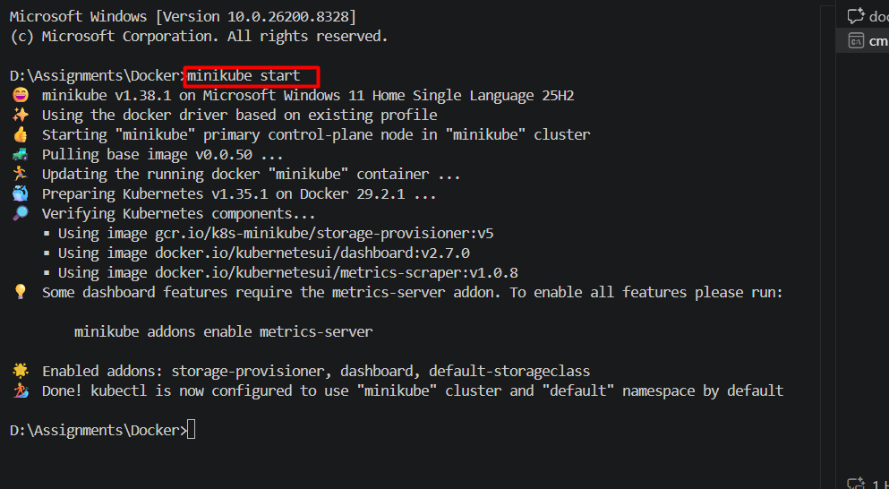
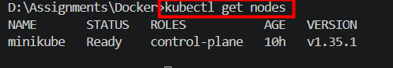
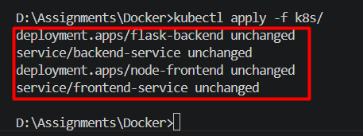
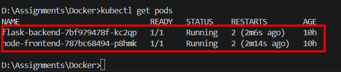
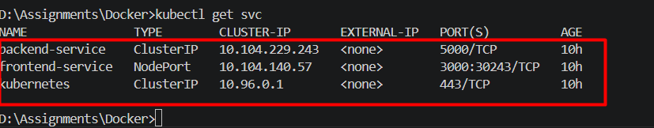
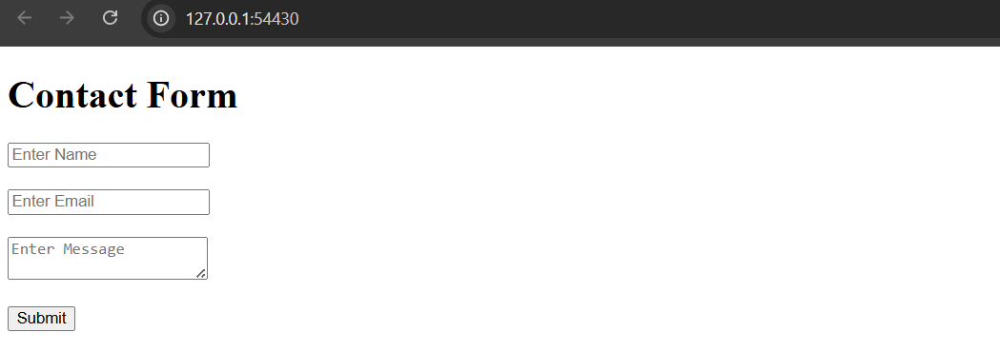
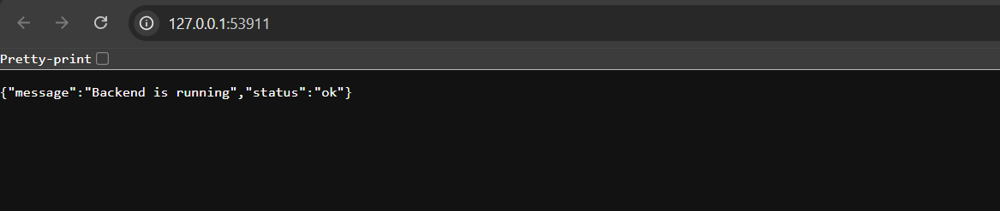

minikube start

kubectl get nodes

kubectl apply -f k8s/

kubectl get pods

kubectl get svc


git init
git add .
git commit -m "Kubernetes deployment with Minikube"
git branch -M main
git remote add origin https://github.com/NaveenKumarRB/K8s_project.git

git push -u origin main

# Flask + Node.js Kubernetes Deployment

## Technologies Used

- Flask
- Node.js
- Docker
- Kubernetes
- Minikube

## Start Minikube

```bash
minikube start


output


