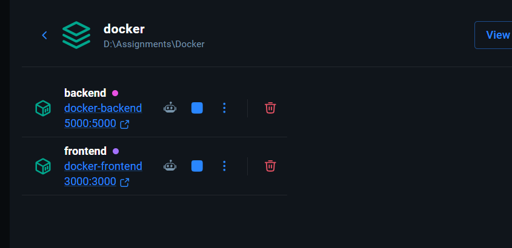
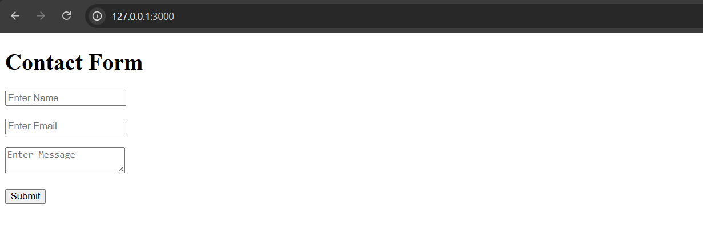
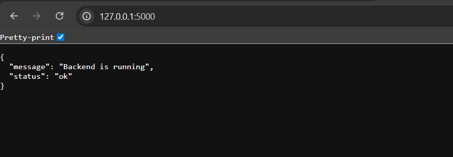
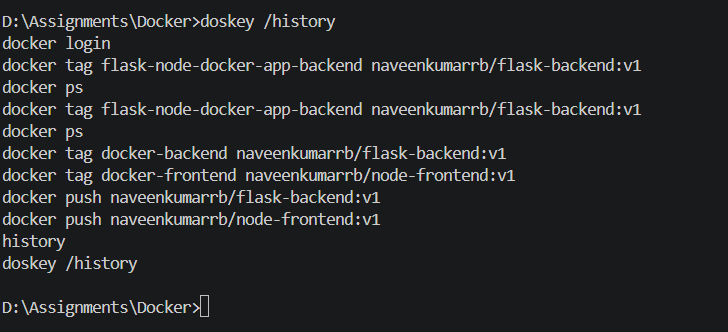
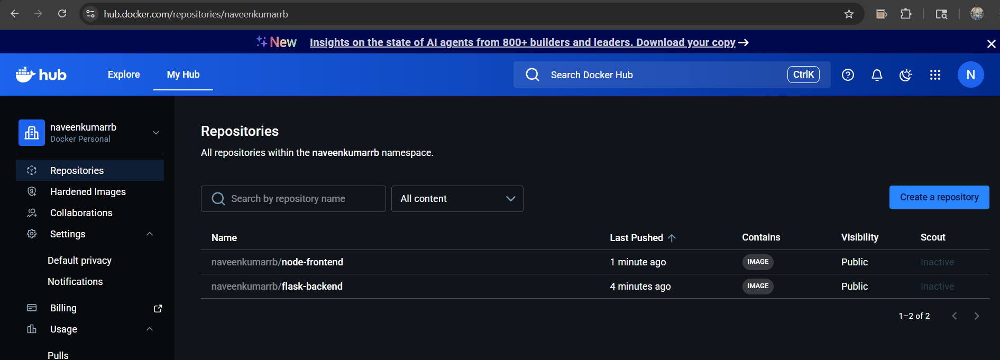

flask-node-docker-app/
│
├── frontend/
│   ├── app.js
│   ├── package.json
│   ├── Dockerfile
│   ├── .dockerignore
│   └── views/
│       └── index.ejs
│
├── backend/
│   ├── app.py
│   ├── requirements.txt
│   ├── Dockerfile
│   └── .dockerignore
│
├── docker-compose.yaml
├── .gitignore
└── README.md


Commands to Run
Build and Start Containers

docker compose up --build



Access Application

Frontend: http://localhost:3000


Backend:http://localhost:5000


Docker Hub Push


docker login

Tag Images

docker tag docker-backend naveenkumarrb/flask-backend:v1

docker tag docker-frontend naveenkumarrb/node-frontend:v1


Push Images

docker push naveenkumarrb/flask-backend:v1

docker push naveenkumarrb/node-frontend:v1



GitHub Push


Initialize Git

git init

Add Files

git add .

Commit

git commit -m "Initial commit"

Add Remote Repo

git remote add origin YOUR_GITHUB_REPO_LINK

Push

git branch -M main

git push -u origin main


# Flask + Node.js Docker Application

## Technologies Used

- Flask
- Node.js
- Express
- Docker
- Docker Compose

## Run Project

```bash
docker compose up --build